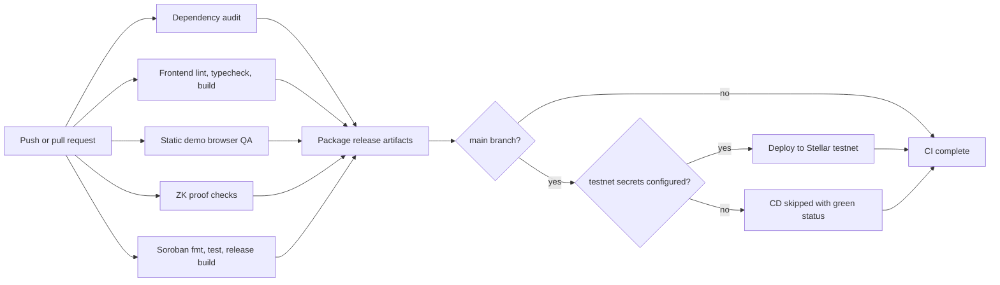

# CI/CD Pipeline

This repository uses GitHub Actions to keep every change on a green path before release packaging or testnet deployment.

## Pipeline Diagram

## Gates

- `Dependency audit`: installs root Node dependencies with `npm ci` and fails on high-severity advisories.
- `Frontend lint, types, build`: installs the Next.js app with the checked-in pnpm lockfile, then runs linting, TypeScript, and production build.
- `Static demo browser QA`: serves `frontend/`, launches Chrome, and runs landing-page and routed-page browser checks.
- `ZK proof checks`: validates Merkle utility tests, proving artifacts, and negative proof cases.
- `Soroban contract checks`: enforces Rust formatting, runs the contract test suite, and builds the release artifact.
- `Package release artifacts`: runs only after all required gates are green and uploads docs, deployment metadata, the static frontend, and canonical verification keys.
- `Testnet CD gate`: runs only on `main`. It deploys when the `STELLAR_*` environment secrets are configured; otherwise it exits green after recording that deployment was skipped.

## Testnet Secrets

Configure these GitHub environment secrets under the `testnet` environment when automated deployment is ready:

- `STELLAR_SOURCE_ACCOUNT`
- `STELLAR_SECRET_KEY`
- `STELLAR_TOKEN_ADDRESS`
- `STELLAR_FX_ORACLE`
- `STELLAR_INITIAL_ROOT`
- `STELLAR_ASP_ROOT`
- `STELLAR_DENY_LIST_JSON`
